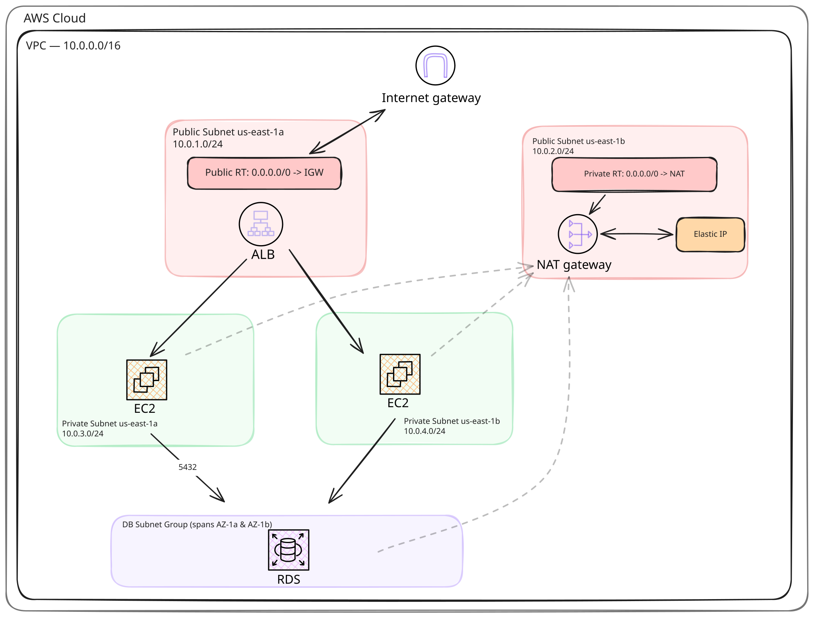

# aws-vpc-architecture-terraform

A minimal, runnable example of a classic 3-tier AWS architecture — VPC, public/private subnets across two AZs, an Application Load Balancer, two EC2 instances, an RDS Postgres database, and an S3 bucket — built entirely in Terraform and designed to run **locally** against [MiniStack](https://ministack.org), a free, open-source AWS emulator.

No AWS account, no billing, no real credentials required.



## What gets provisioned

- **VPC** (`10.0.0.0/16`) spanning `us-east-1a` and `us-east-1b`
- **2 public subnets** (`10.0.1.0/24`, `10.0.2.0/24`) with an Internet Gateway
- **2 private subnets** (`10.0.3.0/24`, `10.0.4.0/24`) with a NAT Gateway for outbound access
- **Application Load Balancer** in the public subnets, forwarding HTTP (port 80) to
- **2 EC2 instances** in the private subnets, each serving a simple "Hello World" page via Python's built-in HTTP server
- **RDS Postgres instance** in the private subnets, reachable from the EC2 security group on port 5432
- **S3 bucket + DynamoDB lock table** (via `bootstrap/`) acting as this project's own Terraform remote state backend

Security groups are scoped tightly: the ALB accepts inbound HTTP from anywhere, EC2 only accepts traffic from the ALB, and RDS only accepts traffic from the EC2 security group.

## Prerequisites

- [Terraform](https://developer.hashicorp.com/terraform/install) `~> 1.x`
- [MiniStack](https://ministack.org) — install via:
  ```bash
  pip install ministack
  ```
  or run it in Docker:
  ```bash
  docker run -p 4566:4566 ministackorg/ministack
  ```

## Bootstrapping the remote state backend

This project uses an S3 bucket as its own Terraform remote state backend — but that creates a chicken-and-egg problem: `main.tf`'s `backend "s3"` block needs the bucket to already exist before Terraform can even initialize, yet the bucket itself is normally something you'd define _as a resource_ in that same config. You can't have a config write its state into a bucket that config is also responsible for creating — Terraform reads the backend block and tries to reach that bucket during `terraform init`, long before any resource (including the bucket) has been planned or applied.

There's a second wrinkle too: a `backend` block can't reference variables, locals, or other resources — every value in it has to be a literal, because it's parsed before the rest of the configuration is evaluated at all.

The standard fix is to split state-backend infrastructure into its own **bootstrap** config that keeps local state permanently:

1. `bootstrap/` creates the S3 bucket and a DynamoDB lock table, using **local** state (a `terraform.tfstate` file on disk). It has no backend block — it can't, for the same chicken-and-egg reason.
2. The root `main.tf` then points its `backend "s3"` block at that bucket (and lock table) as static, hardcoded values, and stores its own state there.

Because `bootstrap/` owns the bucket as a _managed resource_ and the root config only _references_ it by name in the backend block, there's no conflict between the two — just make sure you never re-add an `aws_s3_bucket` resource for `tf-test-bucket` to the root config, or Terraform will try to manage the same bucket in two places at once.

## Quickstart

1. **Start MiniStack** (in its own terminal):

   ```bash
   ministack
   # Runs on http://localhost:4566
   ```

2. **Bootstrap the state backend** (one-time per MiniStack instance):

   ```bash
   cd bootstrap
   terraform init
   terraform apply
   cd ..
   ```

   This creates `tf-test-bucket` and `tf-test-lock-table` using local state — don't delete `bootstrap/terraform.tfstate`, it's the only record Terraform has of that bucket.

3. **Initialize and apply the main config**:

   ```bash
   terraform init
   terraform apply
   ```

   `terraform init` here connects to the S3 backend you just bootstrapped. Review the plan and type `yes` to confirm.

4. **Verify resources spun up**, e.g.:

   ```bash
   curl http://localhost:4566/_ministack/health
   ```

5. **Tear everything down** when you're done, **in this order**:
   ```bash
   terraform destroy          # destroys the app infra (VPC, EC2, ALB, RDS, ...)
   cd bootstrap
   terraform destroy          # destroys the state bucket + lock table last
   cd ..
   ```
   Destroying the bucket before the main stack is torn down would delete the state file the main config needs to plan its own destroy.

## Project structure

```
.
├── main.tf              # App infra (VPC, networking, ALB, EC2, RDS) + S3 backend config
├── bootstrap/
│   └── main.tf          # State bucket + lock table, kept on LOCAL state
├── assets/
│   └── architecture.svg
└── README.md
```

> `main.tf` is intentionally a single file for readability. For a real project, split it into `network.tf`, `compute.tf`, `database.tf`, `variables.tf`, and `outputs.tf`.

## Important notes

- **Not for production.** This config uses hardcoded mock AWS credentials (`mock_access_key` / `mock_secret_key`) and a hardcoded RDS username/password (`admin` / `admin`) purely so the demo runs with zero setup against MiniStack. **Never reuse these values against a real AWS account.**
- **AMI ID is a placeholder.** `ami = "al2023-ami"` is not a real AMI identifier — MiniStack's EC2 emulation doesn't validate it, but this template will fail against real AWS as-is. Swap in a real AMI ID (e.g. via `data "aws_ami"`) before ever pointing this at a live account.
- **Single-AZ RDS.** The DB subnet group spans both private subnets for future Multi-AZ support, but `multi_az` isn't set, so this deploys a single instance.
- **`bootstrap/` state is precious.** It's the only pointer Terraform has to the bucket backing the main config's state. Back up `bootstrap/terraform.tfstate` (or at least don't `.gitignore` it away) if this were ever more than a local demo.

## License

MIT — use it, fork it, adapt it.
